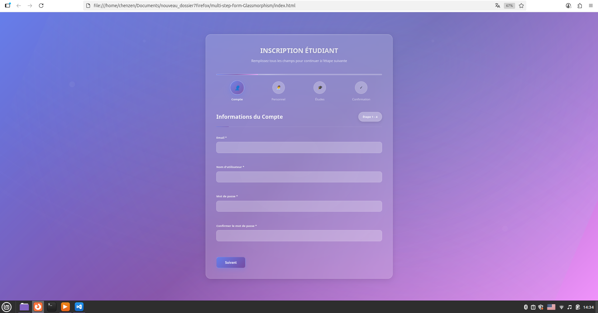

# 🎓 Student Registration Form (Glassmorphism Edition)

A modern **multi-step student registration form** built with HTML, CSS, and JavaScript.  
This version features a **glassmorphism-inspired UI** with shimmer effects, layered shadows, and grain particles for a stylish user experience.

## ✨ Features

- 📋 Four-step navigation (Account → Personal → Studies → Confirmation)  
- ✅ Real-time field validation with error messages  
- 🖼️ Glassmorphism design with shimmer, multi-layered shadows, and particle effects  
- 📱 Fully responsive layout for desktop and mobile  
- 🎯 Automatic input formatting (phone number, names)  
- 📑 Summary of all data before confirmation  
- 🎉 Success screen with confirmation message  

## 🖼️ Screenshot



---

## 🚀 Installation

Clone the repository:

```bash
git clone git@github.com:CryoPoint/multi-step-form-Glassmorphism.git
cd multi-step-form-Glassmorphism


Then simply open index.html in your browser.


🛠️ Technologies

HTML5 for structure

CSS3 with glassmorphism effects, shimmer animations, and layered shadows

Vanilla JavaScript for form logic and validation


🤝 Contribution

Contributions are welcome!

Fork the project

Create a branch (git checkout -b feature/new-feature)

Commit your changes (git commit -m 'Add new feature')

Push to your branch (git push origin feature/new-feature)

Open a Pull Request